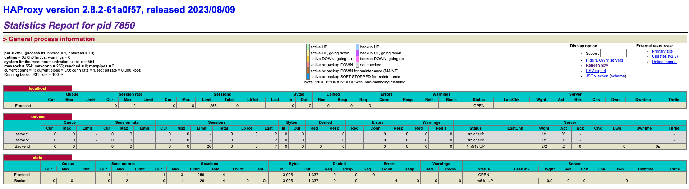

# MacOS에서 HAProxy 설정하기. 

## 수행과정

- HAProxy를 MacOS에 설정하기 위해서 다음과정을 수행한다. 
  - 1. brew를 이용하여 haproxy 설치하기
  - 2. config 파일 작성하기 
  - 3. haproxy 실행하기
  - 4. haproxy 모니터링 화면 확인하기

## HAProxy 설치

- macos에서 brew를 이용하여 haproxy를 설치하자. 

### brew 설치 

- brew가 설치되어 있지 않다면 [다음 페이지](https://docs.brew.sh/Installation)에서 brew를 우선 설치한다. 

### HAProxy 설치 

- brew가 설치 되었다면 이제는 haproxy를 다음 커맨드로 설치한다. 

```py
brew install haproxy
Running `brew update --auto-update`...
==> Auto-updated Homebrew!
Updated 2 taps (homebrew/core and homebrew/cask).

... 생략 ...

To start haproxy now and restart at login:
  brew services start haproxy
Or, if you don't want/need a background service you can just run:
  /opt/homebrew/opt/haproxy/bin/haproxy -f /opt/homebrew/etc/haproxy.cfg
==> Summary
🍺  /opt/homebrew/Cellar/haproxy/2.8.2: 9 files, 3.6MB
```

- 설치를 하고 나면 실행 방법이 간단하게 로그로 나타난다. 

```py
brew servcies start haproxy
```

- 위 명령을 실행하면 백그라운드로 haproxy가 실행된다고 나온다. 
- 만약 설정파일을 함께 지정하고, 직접 실행하고자 한다면 다음 커맨드를 이용하라고 설명하고 있다.
- 즉, 설정파일의 위치를 직접 지정하기 위해서 '-f' 옵션을 사용하는 것을 확인하자.  

```py
/opt/homebrew/opt/haproxy/bin/haproxy -f /opt/homebrew/etc/haproxy.cfg
```

- 처음 설치하는 경우 위 경로에 haproxy.cfg 파일이 없다는 것을 알 수 있다. 

## config.cfg 파일 작성하기

- 이제 config.cfg 파일을 작성해서 proxy 대상을 지정해보자. 

```py
global 
  daemon 
  maxconn 40 
 
defaults 
  mode http 
  timeout connect 5000ms 
  timeout client 50000ms 
  timeout server 50000ms 
 
frontend localhost 
  bind *:80
  default_backend servers 
 
backend servers 
  server server1 127.0.0.1:7121 
  server server2 127.0.0.1:7122

listen stats 
    bind :9000 
    stats enable
    stats realm Haproxy\ Statistics  
    stats uri /haproxy_stats  
    stats auth Username:Password   

```

### 기본구조 

```py
global
    # global settings here

defaults
    # defaults here

frontend
    # a frontend that accepts requests from clients

backend
    # servers that fulfill the requests
```

- global 은 전역 세팅을 수행하는 영역이다. 
- defaults는 기본 프록시를 위한 설정 정보를 지정한다. 
- frontend는 클라이언트가 접속하는 프런트엔드 포트와 각 설정을 수행할 수 있다. 
- backend는 프런트엔드가 서버로 프록시하게 되며, 클라이언트 요청을 처리하는 역할을 하는 서버 목록을 기술하게 된다. 

#### Global 영역

- maxconn
  - HAProxy로 접근할 클라이언트의 최대 연결 개수를 지정한다. 
  - 이를 통해서 로드밸런서가 메모리 부족으로 다운되는 것을 방지할 수 있다. 
  - 메모리 요구사항을 수용하기 위한 적절한 커넥션 수는 [sizing guide](https://www.haproxy.com/documentation/hapee/1-8r1/onepage/intro/#3.5)를 참조하자. 

#### Defaults

- mode http
  - 모드는 haproxy가 사용할 프로토콜을 지정한다. http를 지정하면 연결을 위해서 tcp연결을 수행하게 된다. 
- timeout connect
  - 백엔드 서버로 연결을 설정할 때 타임아웃을 지정한다. 
- timeout client
  - 클라이언트가 요청을 보낼 것으로 예상되는 시간이다. TCP세그먼트를 보내는 기간동안 활동이 없음을 측정한다. 
- timeout server
  - 백엔드 서버로 응답을 받기위해 대기하는 시간이다. 

#### frontend

- bind
  - 주어진 ip/port 로 클라이언트 요청을 listen한다는 것을 알려준다. 
  - ip주소를 * 로 두어 어떠한 값이 들어오든지 신경쓰지 않을 수 있다. 
- default_backend
  - default_backend는 거의 모든 프런트엔드에 있으며, use_backend 규칙이 트래픽을 다른곳으로 먼저 보내지 않으면 기본 백엔드로 프록시한다는 의미이다. 
  - use_backend나 default_backend 값이 설정되어 있지 않으면 503 Service Unavailable에러가 나게 된다. 

#### backend

- backend servers
  - backend 의 이름을 servers로 지정했다. 
- server server1 127.0.0.1:7121 
  - server의 이름을 server1로 지정한다. 
  - server의 ip/port를 지정하게 된다. 
  - 이렇게 server를 작성하면 클라이언트 요청을 백엔드 서버 중 하나로 프록시 하게 된다. 


- 상세한 설정 정보를 확인하고자 하면 [다음 메뉴얼](https://www.haproxy.com/blog/the-four-essential-sections-of-an-haproxy-configuration)을 참조하자. 


## haproxy 실행하기. 

- 이제 cfg파일을 작성했으니 haproxy를 직접 실행해보자. 

```py
haproxy -f <cfg 파일경로>
```

- 위 커맨드로 실행이 가능하다. 

### 실행시 이슈 해결 

- 만약 실행했는데 "Missing LF on last line, file might have been truncated at position 3." 과 같은 에러가 난다면 다음 커맨드를 수행해보자. 
  
```py
echo "" >> haproxy.cfg
```

- port 80이 이미 떠있어서 충돌나는 경우 'haproxy.cfg' 파일 내부 바인드 포트를 바꿔주자. 

```py
frontend localhost 
  bind *:81
```

- 포트를 81로 바꿔주었다. 
- 이제 http://localhost:81 로 접속하면, 서버로 프록시 되는 것을 확인할 수 있다. 

## HAProxy 모니터링

- 위 cfg 파일에서 haproxy를 위한 모니터링 설정을 했었다. 

```py
listen stats 
    bind :9000 
    stats enable
    stats realm Haproxy\ Statistics  
    stats uri /haproxy_stats  
    stats auth Username:Password   
```

- 바인드 포트는 9000번이다. 
- 통계정보를 활성화 하기 위해서 stats enable 라고 지정했다. 
- 통계 접속 uri는 /haproxy_stats 이다. 
- 접속시 id/pwd를 지정하기 위해서 auth 속성을 지정했다. 
- 통계 페이지에 대해 상세정보는 [다음](https://www.haproxy.com/blog/exploring-the-haproxy-stats-page/)을 참조하자. 

<br/>

- 접속을 위해서 http://localhost:9000/haproxy_stats 로 접근하고 ID/PWD를 설정하면 다음 결과를 확인할 수 있다. 
  


## WrapUp

- HAProxy를 설치하고, 설정을 해 보았다. 
- 프런트엔드 포트를 81로 설정했으므로 http://localhost:81 로 접근하여 프록시를 수행할 수 있다. 
- 프록시 대상 서버는 7121, 7122 포트이고, 요청이 들어오면 해당 포트로 프록시 해주게 된다. 


- 